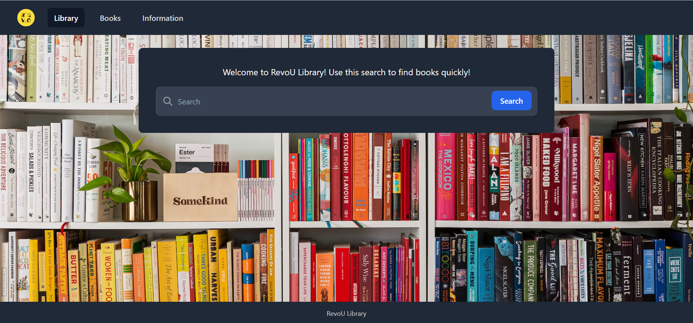

# Library Tailwind Week 9

Library Management System

## :scroll: Description

This is a web-based application that allows users to manage a library's collection of books. Users can search for specific titles. The application also includes a feature for users to check their books out in a paginated way.

## :hammer_and_wrench: Tech Stack

